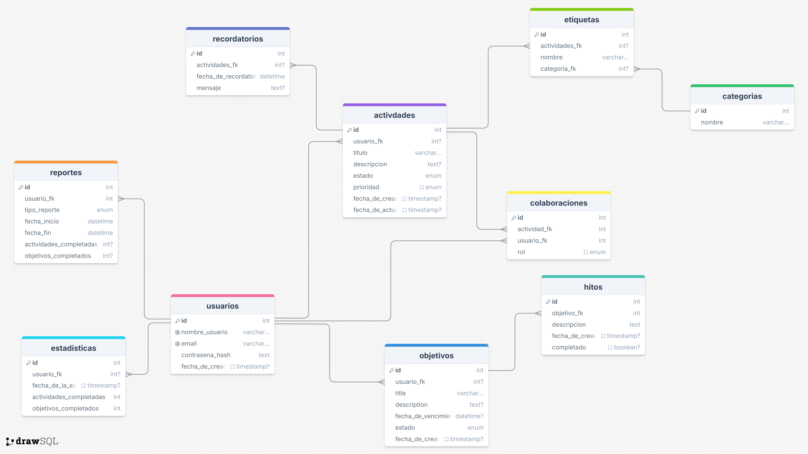

<h1 align="center">Daily Activities API</h1>
<p></p>

## Índice
- [Base de datos](#BBDD)
- [Documentación API](#API)

<h2 name="BBDD">Base de datos</h2>
<p>Para la creación de la base de datos se tuvo en cuenta como punto de partida el modelo E-R proporcionado para el proyeccto.</p>

<h3>Modelo E-R</h3>
<p></p>
<p align="center"></p>

<h3>Normalización</h3>
<p></p>

<h4>1FN</h4>
<p></p>
<p align="center"></p>

<h4>2FN</h4>
<p></p>
<p align="center"></p>

<h4>3FN</h4>
<p></p>
<p align="center"></p>

<h3>Modelo Físico</h3>
<p></p>

```sql

```
<h2 name="API">Documentación API</h2>
<p></p>

<h3>Swagger</h3>
<p></p>
<p>Link: https://app.swaggerhub.com/apis-docs/DANIDIDIFB/DailyActivities/1.0.0</p>

<h3>End Points</h3>
<table align="center">
  <tr>
    <td width=20><h3 align="center">Ruta<h3></td>
    <td width=10><h3 align="center">Método<h3></td>
    <td width=70><h3 align="center">Descripción<h3></td>
  </tr>
  <tr>
    <td width=20>/usuarios/iniciarSesion</td>
    <td width=10><i>POST</i></td>
    <td width=70>Obtiene la información del usuario excluyendo <b>contrasena_hash</b> y el campo <b>fecha_de_creacion</b>, devuelve la fecha y hora actual del inicio de sesión. Además, se cambia el nombre del campo a <b>fecha_y_hora_de_inicio_de_sesion</b>.</td>
  </tr>
  <tr>
    <td width=20>/usuarios/validarSesion</td>
    <td width=10><i>POST</i></td>
    <td width=70>Descifrar la sesión proporcionada en el header: <br><code>Authorization: Bearer [token]</code></br> y retornar la información que incluye.</td>
  </tr>
</table>
